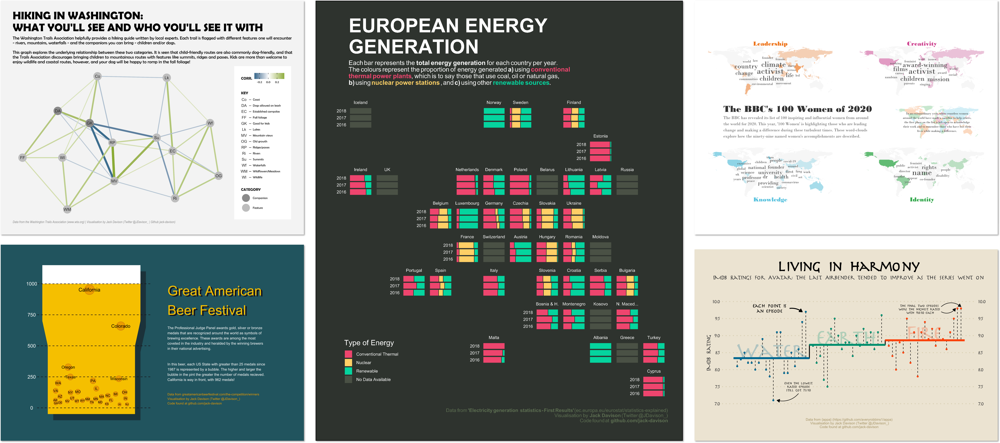

# TidyTuesday in *Observable Framework*
## by [Jack Davison](https://jack-davison.github.io/)

[🔗 Web](https://jack-davison.github.io/) | 
[🧑‍💻 GitHub](https://github.com/jack-davison) | 
[🐘 Mastodon](https://fosstodon.org/@jackdavison) | 
[✖️ X (twitter)](https://x.com/jdavison_) | 
[🏢 LinkedIn](https://www.linkedin.com/in/jack-davison/)

---

[TidyTuesday](https://github.com/rfordatascience/tidytuesday) is a weekly social data project. All are welcome to participate! Data is posted to social media every Monday morning. Create a visualization, a model, a shiny app, or some other piece of data-science-related output, using R or another programming language. [Learn more](https://github.com/rfordatascience/tidytuesday).

In 2020, I started taking part in TidyTuesday to get better at R - specifically, ggplot2. You can see some of my nicest `ggplot2` figures below, and all of them [here](https://github.com/jack-davison/TidyTuesday).

This repository is an attempt to do the same thing but with JavaScript; specifically, [Observable JavaScript](https://observablehq.com/) done in [Observable Framework](https://observablehq.com/platform/framework). The power of OJS interests me coming from an R background; it is a great halfway-house between a [Quarto](https://quarto.org/) document (static, but limited) and a [Shiny](https://shiny.posit.co/) app (limitless, but needing a server).

You can use the sidebar on the left-hand side to navigate between dashboards.
